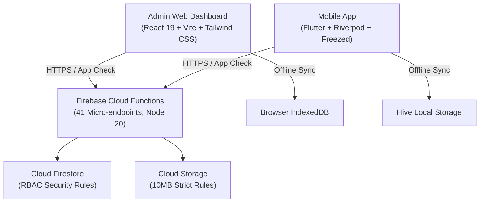

# Field Data Collection Hub - AHQAM

منصة جمع البيانات الميدانية

A production-ready, Arabic-first, bilingual dynamic mobile application and responsive Admin Web Portal designed for arbitrary, multi-purpose field data collection (surveys, facility audits, inspections, customer evaluations, inventory, and record verification).

---

## Key Highlights

- **Dynamic Multi-Purpose Architecture**: No hardcoded entity constraints. Orders support custom target entity labels (`targetEntityLabelAr` / `targetEntityLabelEn`, e.g., _Facility, School, Clinic, Store, Beneficiary, Record_).
- **Visual Drag & Drop Form Builder**: Supports 10+ field types (text, numbers, ratings, dropdowns, dates, photos, locations, signatures) with conditional visibility rules and ready-to-use presets (General Survey, Asset & Facility Audit, Inactivity Audit).
- **Intelligent Excel Import Wizard**: Automatically maps generic headers (`معرف_الجهة`, `اسم_الجهة`, `الفرع`, `المنطقة`, `الموقع`) with row-by-row validation, duplicate detection, and instant preview.
- **Offline-First Resilience**: PWA with IndexedDB durable offline queue for web, and Hive-powered offline queue in Flutter mobile with automatic background synchronization upon network reconnection.
- **Enterprise Security & Compliance**:
  - Firebase App Check (reCAPTCHA v3 on Web, Play Integrity on Android, DeviceCheck on iOS).
  - RBAC with custom claims (`ADMIN`, `SUPERVISOR`, `REP`), branch/region scoping, and device binding.
  - Immutable audit logs written by trusted Cloud Functions.
- **Observability & Error Telemetry**: Integrated Sentry error monitoring with local ring-buffer fallback.

---

## Architecture



1. **Admin Web Portal (`/src`)**: Built with React 19, TypeScript, and Vite. Provides campaign management, form building, bulk user/record imports, live supervisor matrices, and interactive Excel/chart reports.
2. **Mobile Application (`/mobile`)**: Built with Flutter (Riverpod, Freezed, GoRouter). Empowers field users to view assigned tasks, fill dynamic forms offline, capture photos/locations, and submit data seamlessly.
3. **Backend Microservices (`/firebase/functions`)**: 41 Cloud Functions endpoints covering authentication, device binding, regional assignments, imports, dynamic form snapshots, notifications, and export generation.

---

## Testing & Quality Assurance

- **Web Unit & Hook Tests**: 17 test suites, **94/94 tests passing** (`npm test -- --run`).
- **End-to-End Simulation**: Complete lifecycle test (`e2eDataCollectionSimulation.test.ts`) covering order creation, Excel import, assignment, user submission, and dynamic reporting.
- **Cloud Functions Tests**: 9 test suites, **27/27 tests passing** (100% module coverage).
- **Flutter Mobile Tests**: **18/18 tests passing** (`flutter test`) with 0 static analysis issues (`flutter analyze`).
- **Lighthouse Performance Baseline**: See [`LIGHTHOUSE_BASELINE.md`](./LIGHTHOUSE_BASELINE.md) for Core Web Vitals (FCP 1.1s, LCP 1.7s, CLS 0.00).

---

## Deployment

### Prerequisites

- Node.js 20+
- Flutter SDK (latest stable)
- Firebase CLI (`npm install -g firebase-tools`)

### 1. Firebase Backend

```bash
cd firebase/functions
npm install
npm run build
firebase deploy --only functions,firestore:rules,storage
```

### 2. React Admin Dashboard

```bash
npm install
npm run build
firebase deploy --only hosting
```

Live URL: `https://landsurvey-ebb3b.web.app`

### 3. Flutter Mobile App

```bash
cd mobile
flutter pub get
dart run build_runner build --delete-conflicting-outputs
flutter test
flutter build apk --release
```

---

## License & Contributing

- **License**: [MIT License](./LICENSE)
- **Contributing**: [Contribution Guidelines](./CONTRIBUTING.md)
- **Architecture Details**: [System Architecture](./ARCHITECTURE.md)

---

_Field Data Collection Hub - Built with Google Antigravity IDE_
