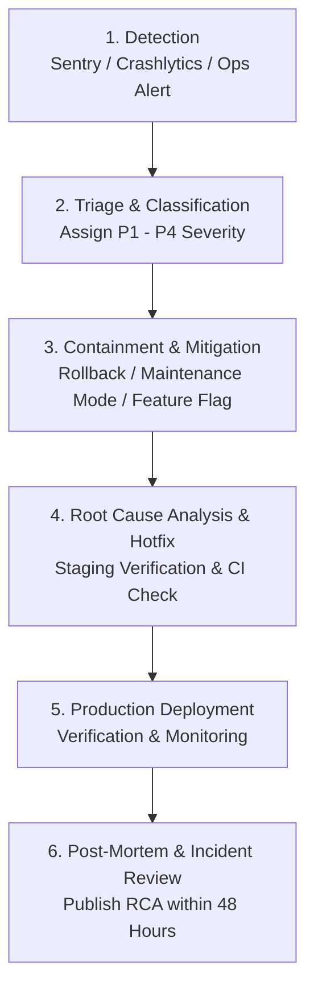

# Sales Collection Hub — Incident Response (IR) Plan & Sentry Governance

**Version:** 1.0.0  
**Effective Date:** September 2026  
**Document Owner:** Lead DevOps & Systems Engineering Team  
**Scope:** Web Admin Portal, Mobile Field Application (Flutter), and Firebase Cloud Functions Backend.

---

## 1. Executive Summary & Objective

This document defines the standard operating procedures (SOP) for detecting, categorizing, triaging, mitigating, and documenting operational and technical incidents within the **Sales Collection Hub** ecosystem.

With Sentry (`@sentry/react`) actively capturing errors, breadcrumbs, and performance telemetry on the Web Portal, and Firebase Crashlytics monitoring the Flutter Mobile client, this governance framework defines **who receives alerts**, **how fast they must respond**, and the **exact runbooks to resolve critical incidents**.

---

## 2. Incident Classification & Service Level Objectives (SLAs)

| Severity          | Definition & Examples                                                                                                                                 | Target Ack (MTTA)    | Target Resolution (MTTR) | Notification Channels                                                                  |
| :---------------- | :---------------------------------------------------------------------------------------------------------------------------------------------------- | :------------------- | :----------------------- | :------------------------------------------------------------------------------------- |
| **P1 — Critical** | Complete service outage; inability for field representatives to submit records; widespread auth failures; data corruption or Firestore write failure. | **< 15 minutes**     | **< 2 hours**            | SMS / Phone Call + Sentry High-Priority Webhook + PagerDuty / Emergency WhatsApp/Slack |
| **P2 — High**     | Core feature impaired with no immediate workaround (e.g., offline sync failing for a branch, device unbinding blocked, report exports timing out).    | **< 30 minutes**     | **< 6 hours**            | Sentry Alert Email + DevOps Slack Channel                                              |
| **P3 — Medium**   | Non-critical functionality degraded with available workaround (e.g., Arabic/English display glitch, slow query on historical reports).                | **< 2 hours**        | **< 24 hours**           | Sentry Digest Email + Jira / GitHub Issues                                             |
| **P4 — Low**      | Minor cosmetic defects, isolated UI glitches, or low-frequency warnings that do not impact data integrity or user operations.                         | **< 1 business day** | Next Sprint Cycle        | GitHub Issues backlog                                                                  |

---

## 3. Incident Management Team & Escalation Matrix

### 3.1. Roles and Responsibilities

| Role                                 | Responsibility                                                                                  | Primary Contact                   | Secondary / Backup |
| :----------------------------------- | :---------------------------------------------------------------------------------------------- | :-------------------------------- | :----------------- |
| **Incident Commander (IC)**          | Owns communication, delegates triage, approves emergency rollbacks or hotfixes.                 | Lead Developer / Engineering Lead | Product Manager    |
| **Technical Lead (Backend/Cloud)**   | Investigates Cloud Functions, Firestore indexes, IAM drift, and Firebase service quotas.        | Senior Backend Engineer           | DevOps Engineer    |
| **Technical Lead (Frontend/Mobile)** | Investigates React Web Portal errors, Sentry breadcrumbs, and Flutter Crashlytics stack traces. | Senior Frontend/Mobile Engineer   | QA Lead            |
| **Communications Lead**              | Informs branch supervisors and field operations managers of outage and restoration ETA.         | Operations Coordinator            | Support Lead       |

### 3.2. Sentry & Monitoring Alert Routing

1. **Sentry Alert Rules (`VITE_SENTRY_DSN`):**
   - **Rule 1 (P1 Trigger):** When an unhandled error rate exceeds 20 events in 5 minutes, or `unhandled:true` with tag `component:ErrorBoundary`.
   - **Rule 2 (P2 Trigger):** Any error matching `userApi.*`, `recordApi.*`, or `FirebaseError: permission-denied`.
   - **Recipients:** Configured to push alerts to the dedicated Slack `#alerts-production` webhook and email `dev-oncall@landsurvey-ebb3b.iam.gserviceaccount.com`.
2. **Firebase Crashlytics Alerts:**
   - Velocity alerts triggered when an app crash impacts > 1% of active field reps within 1 hour.
3. **Escalation Policy:**
   - If a **P1 alert** is unacknowledged within **15 minutes**, Sentry automatically escalates to secondary phone/SMS notification to the Engineering Lead.

---

## 4. Incident Lifecycle Workflow



### Step 1: Detection & Confirmation

- Confirm whether the alert is a true incident using Sentry's **Session Replay** and **Breadcrumb trail**.
- Validate if the issue affects production (`landsurvey-ebb3b.web.app`) or staging (`datacollectionportal-staging.web.app`).

### Step 2: Triage & Declaration

- Incident Commander (IC) creates an incident ticket / Slack channel: `#inc-YYYYMMDD-[brief-description]`.
- Record the incident start time, affected user roles (`ADMIN`, `SUPERVISOR`, `REP`), and geographic regions.

### Step 3: Containment

- Determine if immediate mitigation is needed before finding the root cause:
  - **Rollback Web Hosting:** Instant rollback to previous release via Firebase Console or CLI:
    ```bash
    firebase hosting:clone landsurvey-ebb3b:previous_version landsurvey-ebb3b:live
    ```
  - **Database Protection:** If malicious writes or rule exploits occur, immediately deploy emergency lockdown rules:
    ```bash
    firebase deploy --only firestore:rules --project landsurvey-ebb3b
    ```

### Step 4: Remediation & Verification

- Develop hotfix on a `hotfix/issue-description` branch.
- **Mandatory Staging Verification:** Deploy to `datacollectionportal-staging` and execute automated integration tests before touching production.
- Review against CI checks (`web-ci.yml`, `firebase-ci.yml`).

### Step 5: Resolution & Post-Mortem

- Deploy hotfix to production.
- Monitor Sentry for 30 minutes to confirm error rate drops to zero.
- Publish a formal **Post-Mortem Report (RCA)** within 48 hours for all P1 and P2 incidents.

---

## 5. Technical Runbooks

### Runbook A: Widespread Authentication & Custom Token Failure

- **Symptoms:** Representatives unable to log in; error: _"بيانات الاعتماد غير صحيحة"_ or _"Internal server error"_ across multiple regions.
- **Diagnosis Steps:**
  1. Inspect Google Cloud Console -> Cloud Functions -> `authenticateWithRegionPassword` logs.
  2. Verify Firebase Auth service availability (Google Cloud Status Dashboard).
  3. Check if service account `landsurvey-ebb3b@appspot.gserviceaccount.com` has `Firebase Authentication Admin` role.
  4. Verify App Check token enforcement in `firebase/functions/src/config/appCheck.ts` has not expired or failed verification.
- **Recovery:**
  1. If App Check is rejecting legitimate requests due to secret rotation, temporarily switch App Check enforcement to `enforce: false` in staging/production.
  2. If Bcrypt hash comparisons fail due to corrupted user documents, run audit query:
     ```bash
     firebase functions:log --only authenticateWithRegionPassword --project landsurvey-ebb3b
     ```

---

### Runbook B: High-Volume Sentry Error Spike on Frontend (Crash Loop)

- **Symptoms:** Sentry dashboard alerts > 50 errors/min; ErrorBoundary is displaying to all portal users.
- **Diagnosis Steps:**
  1. Open Sentry Issue details; inspect **Tags**, **URL**, and **Stack Trace**.
  2. Check **Session Replay** to reproduce the exact user action preceding the crash.
  3. Identify if error originated from a newly deployed chunk (`dist/assets/vendor-*.js`).
- **Recovery:**
  1. Perform an immediate Hosting rollback:
     ```bash
     firebase hosting:channel:deploy live --project landsurvey-ebb3b
     ```
  2. Clear browser cache and service worker registration if a PWA cache mismatch occurred.

---

### Runbook C: Firestore Write Contention & Transaction Timeouts

- **Symptoms:** Cloud Functions logs show `10 ABORTED: Too much contention on these documents`.
- **Diagnosis Steps:**
  1. Check `submitResponse` and `saveDraftResponse` function metrics.
  2. Identify if multiple representatives or batch sync processes are updating the exact same `requests/{requestId}` counter simultaneously.
- **Recovery:**
  1. Verify exponential backoff and jitter logic inside `db.runTransaction` calls.
  2. For high-volume counters, migrate from monolithic document counters to distributed counters (`sharded counters`).

---

### Runbook D: Field Device Lockout & Binding Conflicts

- **Symptoms:** Legitimate field representative gets new phone or reinstalls app and receives: _"هذا الحساب مرتبط بجهاز آخر"_ (Account bound to another device).
- **Diagnosis Steps:**
  1. Verify representative's identity with their Branch Supervisor.
  2. Inspect `deviceBindings` collection for `userId == repId` and `status == 'ACTIVE'`.
- **Recovery:**
  1. Supervisor or Admin unbinds device directly via Portal -> User Management -> **"فك ارتباط الجهاز"** (Release Device Binding).
  2. Alternatively, invoke administrative Cloud Function `releaseDeviceBinding({ targetUserId: repId })`.

---

## 6. Post-Mortem (RCA) Template

All P1/P2 incidents must document the following structure within `docs/post-mortems/YYYY-MM-DD-incident-title.md`:

```markdown
# Incident Post-Mortem: [Brief Title]

**Date:** YYYY-MM-DD  
**Severity:** P1 / P2  
**Incident Commander:** [Name]  
**Duration / Outage Window:** HH:MM to HH:MM (Total: X mins)

### 1. Summary

[2-3 sentences explaining what happened and user impact]

### 2. Timeline (UTC+3)

- **10:15** — Sentry triggers P1 alert (unhandled exception in `recordApi`).
- **10:22** — Incident Commander declares P1; on-call team mobilized.
- **10:35** — Root cause identified (missing composite index in Firestore).
- **10:48** — Staging tested with corrected `firestore.indexes.json`.
- **11:02** — Index deployed to production; error rate normalized.

### 3. Root Cause

[Detailed technical explanation of failure mechanism]

### 4. Corrective & Preventative Actions

- [ ] Action item 1 (Owner, Deadline)
- [ ] Action item 2 (Owner, Deadline)
```
